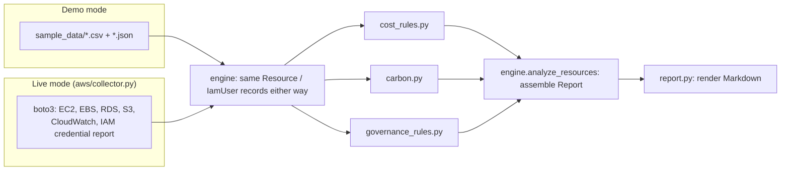

<p align="center">
  
</p>

<p align="center">
  <a href="https://github.com/flango2023/GreenPilot-AI/actions/workflows/ci.yml"></a>
  <a href="https://github.com/flango2023/GreenPilot-AI/actions/workflows/codeql.yml"></a>
  <a href="LICENSE"></a>
  
  <a href="https://greenpilotai.com"></a>
</p>

[**GreenPilot AI**](https://greenpilotai.com) is a pilot-stage product for European SMEs running AWS: read-only cost, carbon, and governance assessment, with every optimization requiring explicit approval before it runs. Most AWS environments waste 25-35% of spend on idle or over-provisioned resources, and most SMEs don't have a dedicated FinOps team to find it.

This repository is the open-source engine behind that assessment: a rule-based analyzer that connects to a real AWS account read-only via boto3 (EC2, EBS, RDS, S3, CloudWatch, IAM credential reports), or runs against committed sample data with no AWS account at all. Both paths run identical rules and produce identical report output. It is not the full product (no dashboard, no ML scoring, no action-execution workflow), but it is real, tested code, not a mockup.

<p align="center">
  
</p>

## Run it

**Demo mode.** No AWS account, no credentials, no network calls. Just the engine, against the sample data committed in this repo (including a synthetic IAM credential report, in AWS's own CSV format):

```bash
git clone https://github.com/flango2023/GreenPilot-AI.git
cd GreenPilot-AI
python3 -m venv .venv && source .venv/bin/activate
pip install -e ".[dev]"

python -m greenpilot analyze sample_data --company "Acme Tech Solutions GmbH"
```

A pre-generated copy of the output is committed at [reports/sample_report.md](reports/sample_report.md).

**Live mode.** Point it at a real AWS account (your own credentials, read-only, revocable at any time):

```bash
pip install -e ".[dev,aws]"
python -m greenpilot analyze --source live --regions eu-west-1,eu-central-1
```

It runs a connectivity check first, prints per-service status to stderr, then scans EC2/EBS/RDS/S3/IAM and generates the same report shape as demo mode, from your actual account. Attach [`iam/read-only-collector-policy.json`](iam/read-only-collector-policy.json) to whatever role or user you run it as; nothing here calls a mutating API.

## What it checks

Five rule-based checks, each matching a waste pattern the live product's Sample Report describes:

| Check | What it catches |
|---|---|
| Idle / underutilized EC2 | Instances running well below CPU capacity, flagged for termination or downsizing |
| Unattached EBS volumes | Storage paying full price with nothing attached to it |
| Redundant RDS configuration | Duplicated read replicas or overlapping Multi-AZ setups |
| Misclassified S3 storage tier | STANDARD storage with infrequent or rare access that belongs in IA or Glacier |
| Schedulable EC2 workloads | Dev/staging instances running 24/7 that only need business hours |

Plus a carbon estimate (`kWh-equivalent usage × regional grid intensity`, see [docs/carbon-methodology.md](docs/carbon-methodology.md)) and EU governance observations for GDPR data residency, NIS2 security posture (including IAM credential hygiene: root account keys, missing MFA, stale access keys, inactive users, parsed from a real AWS `GetCredentialReport`), and CSRD emissions-reporting relevance.

Every finding includes an estimated saving, an effort level, and a rollback note. The live product's own framing:

<p align="center">
  
</p>

## How it's built



Full write-up, including how this maps to the live product's five-stage flow (Connect, Scan, Report, Review & Approve, Execute): [docs/architecture.md](docs/architecture.md).

<p align="center">
  
</p>

```
src/greenpilot/
├── models.py                 # Resource, IamUser, Finding, CarbonEstimate, Report
├── credential_report.py      # parses an AWS IAM credential report (live or sample)
├── rules/
│   ├── cost_rules.py         # the 5 waste checks above
│   ├── carbon.py              # CO2e formula
│   └── governance_rules.py   # GDPR, NIS2 (incl. credential hygiene), CSRD
├── engine.py                  # load_resources/load_iam_users + analyze_resources
├── aws/collector.py           # boto3: maps a live account onto the same records
├── report.py                   # Report -> Markdown
└── cli.py                      # `greenpilot analyze --source sample|live`
```

Demo mode has zero required third-party dependencies: standard library only (`argparse`, `dataclasses`, `csv`, `json`), so `pip install -e .` and running it just works. Live mode adds one optional dependency, `boto3` (`pip install -e ".[aws]"`). 56 tests cover every rule in isolation, both engine paths end-to-end, input validation, output escaping, and the AWS collector itself (via `botocore.stub.Stubber`, so no real AWS account or credentials are needed to run the suite). CI runs them all on every push against Python 3.10 and 3.12.

```bash
pytest -q
```

## Security

Demo mode is a local, offline tool: no network calls, no AWS API calls, no secrets, synthetic sample data only. Live mode calls real AWS APIs, and is built the way the live product's read-only, least-privilege access model requires:

- [`iam/read-only-collector-policy.json`](iam/read-only-collector-policy.json): the exact least-privilege IAM policy `aws/collector.py` needs and nothing more, Get/List/Describe/Generate on read-only report actions only, plus an explicit `Deny` guardrail on destructive actions so it stays safe even if attached alongside a broader policy. Its shape, and that the Deny actually covers real destructive actions without shadowing the two Allow-listed IAM reads, is checked by `tests/test_iam_policy.py`.
- The collector never calls a mutating API: every boto3 call in `aws/collector.py` is a `describe_*`/`get_*`/`list_*`/`generate_credential_report`. There is no code path that could change infrastructure even by accident.
- Input validation: `engine.load_resources` rejects negative costs and negative hours instead of letting them produce a wrong report. See `tests/test_engine_validation.py`.
- Output escaping: `report.py` escapes every resource-derived field before it goes into the Markdown report, so a `|` in a tag can't corrupt the findings table and a `<script>` tag can't reach a future HTML-rendering dashboard unescaped. See `tests/test_report_escaping.py`.
- The AWS collector is tested with `botocore.stub.Stubber`, not against a real account: `tests/test_aws_collector.py` intercepts every call before it would be signed or sent, so CI never needs (and never sees) real AWS credentials.
- CodeQL and Dependabot run on every push (badges above).

Full write-up: [docs/security.md](docs/security.md). To report an issue: [SECURITY.md](SECURITY.md).

## About the live product

<p align="center">
  
</p>

The live product's process, in five stages: **Connect** (read-only AWS access) -> **Scan** (usage, cost, and configuration data) -> **Report** (ranked findings) -> **Review & Approve** (each recommendation individually) -> **Execute** (only what was approved).

The pilot program starts with a free read-only assessment. Paid optimization support begins only after the report has been reviewed and the scope agreed, typically across a 30-day evaluation window. No production changes run without explicit approval.

From the site's About page:

> Richard Schmitz is building GreenPilot AI from Lisbon. His background is in AI and machine learning. GreenPilot started from a direct problem: European SMEs running AWS don't have the tooling to manage cloud cost, carbon, and governance without an enterprise-scale team.

Links:

- [greenpilotai.com](https://greenpilotai.com): the live pilot program
- [Sample Report](https://greenpilotai.com/sample-report.html): the product's own worked example, which this repo's rule engine reproduces the structure of
- [Carbon Methodology](https://greenpilotai.com/carbon-methodology.html): the live methodology `carbon.py` implements
- [LinkedIn](https://www.linkedin.com/company/greenpilotai/)

Roadmap items mentioned on the live site (Azure/GCP support, ML-based optimization scoring, a web dashboard, audit logging, RBAC) are not implemented here. This repo is the rule engine: real and runnable, not the full SaaS product.

## Status

- [x] Rule-based cost engine (EC2, RDS, EBS, S3)
- [x] Carbon estimate
- [x] GDPR / NIS2 / CSRD governance observations, including IAM credential hygiene
- [x] Live AWS collector via boto3 (EC2, EBS, RDS, S3, CloudWatch, IAM credential reports), tested with `botocore.stub.Stubber`
- [x] CI (GitHub Actions, pytest on every push)
- [x] Least-privilege IAM policy, input validation, output escaping, CodeQL, Dependabot
- [x] Screenshots of the live site in `docs/screenshots/`
- [ ] Brand demo video (currently a separate Remotion project, not yet in this repo)
- [ ] Per-resource billing via Cost Explorer / a real CUR export (live mode currently estimates cost from a static on-demand pricing table, documented in `aws/collector.py`)

## License

[MIT](LICENSE) © 2026 Richard Schmitz
