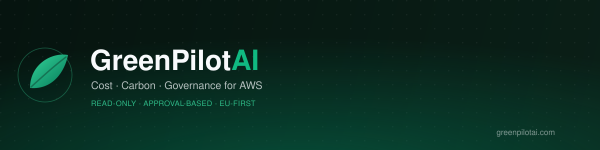
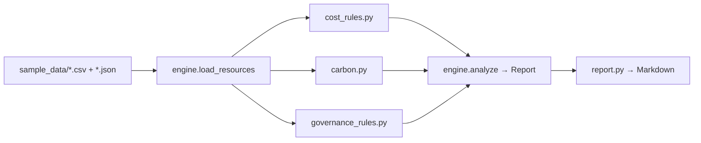

<p align="center">
  
</p>

<p align="center">
  <a href="https://github.com/flango2023/GreenPilot-AI/actions/workflows/ci.yml"></a>
  <a href="LICENSE"></a>
  
  <a href="https://greenpilotai.com"></a>
</p>

European SMEs running AWS usually don't have a dedicated FinOps team — so cloud waste, carbon footprint, and EU compliance exposure (GDPR / NIS2 / CSRD) go unmanaged. **GreenPilot AI** is a pilot-stage assessment product that reads AWS billing and configuration data (read-only, no changes without explicit sign-off) and turns it into a ranked, actionable report.

This repository is the **open-source engine behind that report**: a small, fully-tested Python rule engine you can run right now, on the sample data in this repo, to produce the exact kind of report the live product generates.

```bash
git clone https://github.com/flango2023/GreenPilot-AI.git
cd GreenPilot-AI
python3 -m venv .venv && source .venv/bin/activate
pip install -e ".[dev]"

python -m greenpilot analyze sample_data --company "Acme Tech Solutions GmbH"
```

That's it — no AWS account, no credentials, no network calls. A ready-made example of the output is committed at **[reports/sample_report.md](reports/sample_report.md)**.

## What it actually finds

Five rule-based checks, each mapped to a real AWS cost-waste pattern:

| Check | What it catches |
|---|---|
| Idle / underutilized EC2 | Instances running well below CPU capacity — flagged for termination or downsizing |
| Unattached EBS volumes | Storage paying full price with nothing attached to it |
| Redundant RDS configuration | Duplicated read replicas / overlapping Multi-AZ setups |
| Misclassified S3 storage tier | STANDARD storage with infrequent/rare access patterns that belongs in IA or Glacier |
| Schedulable EC2 workloads | Dev/staging instances running 24/7 that only need business hours |

Plus a **carbon estimate** (`kWh-equivalent usage × regional grid intensity`, see [docs/carbon-methodology.md](docs/carbon-methodology.md)) and **EU governance observations** for GDPR data residency, NIS2 security posture, and CSRD emissions-reporting relevance — the same three regulations the live product's Sample Report covers.

Every finding carries an estimated saving, an effort level, and a rollback note — nothing here just says "delete this," it says how to undo it too.

## How it's built



Full write-up: [docs/architecture.md](docs/architecture.md).

```
src/greenpilot/
├── models.py               # Resource, Finding, CarbonEstimate, Report
├── rules/
│   ├── cost_rules.py        # the 5 waste checks above
│   ├── carbon.py             # CO2e formula
│   └── governance_rules.py   # GDPR / NIS2 / CSRD observations
├── engine.py                # load data, run every rule, assemble a Report
├── report.py                 # Report → Markdown
└── cli.py                    # `greenpilot analyze <data_dir>`
```

No framework dependencies for v1 — pure standard library (`argparse`, `dataclasses`, `csv`, `json`), so `pip install -e .` and running it just works. 23 tests cover every rule in isolation plus a full end-to-end run; CI runs them on every push against Python 3.10 and 3.12.

```bash
pytest -q
```

## About the live product

GreenPilot AI's production architecture (in progress) is a read-only cloud data collector → this rule-based optimization engine → a web dashboard → an approval-based action workflow, where every optimization requires explicit customer sign-off before anything executes. See:

- **[greenpilotai.com](https://greenpilotai.com)** — the live pilot program
- **[Sample Report](https://greenpilotai.com/sample-report.html)** — the product's own worked example, which this repo's rule engine reproduces the structure of
- **[Carbon Methodology](https://greenpilotai.com/carbon-methodology.html)** — the live methodology this repo's `carbon.py` implements
- **[LinkedIn](https://www.linkedin.com/company/greenpilotai/)**

Roadmap items mentioned on the live site (Azure/GCP support, ML-based optimization scoring, a web dashboard, audit logging) are explicitly **not** implemented here — this repo is the honest, runnable core: the rule engine, not the full SaaS product.

## Status & next steps

- [x] Rule-based cost engine (EC2, RDS, EBS, S3) — implemented and tested
- [x] Carbon estimate — implemented and tested
- [x] GDPR / NIS2 / CSRD governance observations — implemented and tested
- [x] CI (GitHub Actions, pytest on every push)
- [ ] Screenshots of the live site in `docs/screenshots/`
- [ ] Brand demo video (currently a separate Remotion project, not yet in this repo)
- [ ] Real AWS Cost Explorer / describe-* data collector (currently: sample data only)

## License

[MIT](LICENSE) © 2026 Richard Schmitz
