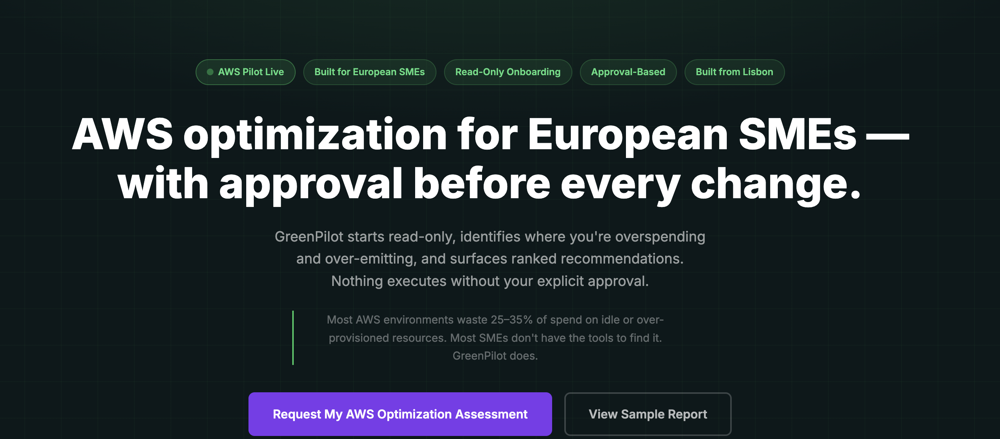
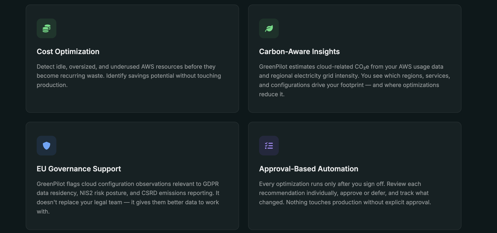
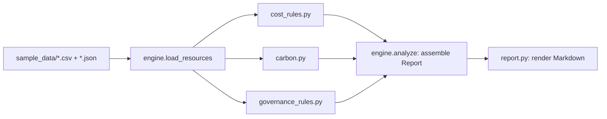
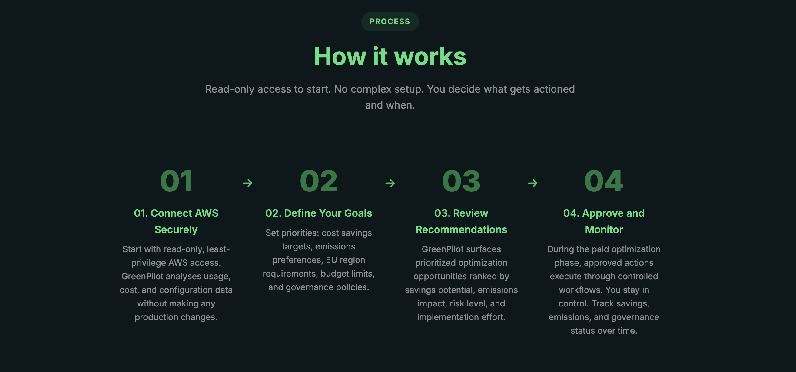
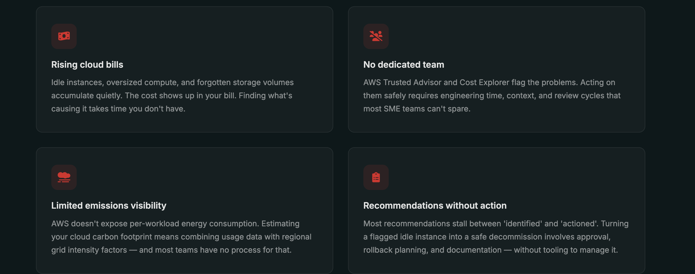

<p align="center">
  
</p>

<p align="center">
  <a href="https://github.com/flango2023/GreenPilot-AI/actions/workflows/ci.yml"></a>
  <a href="https://github.com/flango2023/GreenPilot-AI/actions/workflows/codeql.yml"></a>
  <a href="LICENSE"></a>
  
  <a href="https://greenpilotai.com"></a>
</p>

[**GreenPilot AI**](https://greenpilotai.com) is a pilot-stage product for European SMEs running AWS: read-only cost, carbon, and governance assessment, with every optimization requiring explicit approval before it runs. Most AWS environments waste 25-35% of spend on idle or over-provisioned resources, and most SMEs don't have a dedicated FinOps team to find it.

This repository is the open-source rule engine behind that assessment. It is not the full product (no dashboard, no live AWS connection, no ML scoring), but it is real, tested code that reproduces the report the live product generates, using the exact rules described on the site.

<p align="center">
  
</p>

## Run it

No AWS account, no credentials, no network calls. Just the engine, against the sample data committed in this repo.

```bash
git clone https://github.com/flango2023/GreenPilot-AI.git
cd GreenPilot-AI
python3 -m venv .venv && source .venv/bin/activate
pip install -e ".[dev]"

python -m greenpilot analyze sample_data --company "Acme Tech Solutions GmbH"
```

A pre-generated copy of the output is committed at [reports/sample_report.md](reports/sample_report.md).

## What it checks

Five rule-based checks, each matching a waste pattern the live product's Sample Report describes:

| Check | What it catches |
|---|---|
| Idle / underutilized EC2 | Instances running well below CPU capacity, flagged for termination or downsizing |
| Unattached EBS volumes | Storage paying full price with nothing attached to it |
| Redundant RDS configuration | Duplicated read replicas or overlapping Multi-AZ setups |
| Misclassified S3 storage tier | STANDARD storage with infrequent or rare access that belongs in IA or Glacier |
| Schedulable EC2 workloads | Dev/staging instances running 24/7 that only need business hours |

Plus a carbon estimate (`kWh-equivalent usage × regional grid intensity`, see [docs/carbon-methodology.md](docs/carbon-methodology.md)) and EU governance observations for GDPR data residency, NIS2 security posture, and CSRD emissions-reporting relevance.

Every finding includes an estimated saving, an effort level, and a rollback note. The live product's own framing:

<p align="center">
  
</p>

## How it's built



Full write-up, including how this maps to the live product's five-stage flow (Connect, Scan, Report, Review & Approve, Execute): [docs/architecture.md](docs/architecture.md).

<p align="center">
  
</p>

```
src/greenpilot/
├── models.py               # Resource, Finding, CarbonEstimate, Report
├── rules/
│   ├── cost_rules.py       # the 5 waste checks above
│   ├── carbon.py           # CO2e formula
│   └── governance_rules.py # GDPR, NIS2, CSRD observations
├── engine.py                # load data, run every rule, assemble a Report
├── report.py                 # Report -> Markdown
└── cli.py                    # `greenpilot analyze <data_dir>`
```

No framework dependencies for v1: standard library only (`argparse`, `dataclasses`, `csv`, `json`), so `pip install -e .` and running it just works. 34 tests cover every rule in isolation, the engine end-to-end, input validation, and output escaping. CI runs them on every push against Python 3.10 and 3.12.

```bash
pytest -q
```

## Security

This is a local, offline tool: no network calls, no AWS API calls, no secrets, synthetic sample data only. It is still built the way the live product's read-only, least-privilege access model requires:

- [`iam/read-only-collector-policy.json`](iam/read-only-collector-policy.json): a least-privilege IAM policy (Get/List/Describe only, plus an explicit `Deny` guardrail on destructive actions), scoped to what a real collector would need, matching the access model on [greenpilotai.com/security.html](https://greenpilotai.com/security.html). Its shape is checked by `tests/test_iam_policy.py`.
- Input validation: `engine.load_resources` rejects negative costs and negative hours instead of letting them produce a wrong report. See `tests/test_engine_validation.py`.
- Output escaping: `report.py` escapes every resource-derived field before it goes into the Markdown report, so a `|` in a tag can't corrupt the findings table and a `<script>` tag can't reach a future HTML-rendering dashboard unescaped. See `tests/test_report_escaping.py`.
- CodeQL and Dependabot run on every push (badges above).

Full write-up: [docs/security.md](docs/security.md). To report an issue: [SECURITY.md](SECURITY.md).

## About the live product

<p align="center">
  
</p>

The live product's process, in five stages: **Connect** (read-only AWS access) -> **Scan** (usage, cost, and configuration data) -> **Report** (ranked findings) -> **Review & Approve** (each recommendation individually) -> **Execute** (only what was approved).

The pilot program starts with a free read-only assessment. Paid optimization support begins only after the report has been reviewed and the scope agreed, typically across a 30-day evaluation window. No production changes run without explicit approval.

From the site's About page:

> Richard Schmitz is building GreenPilot AI from Lisbon. His background is in AI and machine learning. GreenPilot started from a direct problem: European SMEs running AWS don't have the tooling to manage cloud cost, carbon, and governance without an enterprise-scale team.

Links:

- [greenpilotai.com](https://greenpilotai.com): the live pilot program
- [Sample Report](https://greenpilotai.com/sample-report.html): the product's own worked example, which this repo's rule engine reproduces the structure of
- [Carbon Methodology](https://greenpilotai.com/carbon-methodology.html): the live methodology `carbon.py` implements
- [LinkedIn](https://www.linkedin.com/company/greenpilotai/)

Roadmap items mentioned on the live site (Azure/GCP support, ML-based optimization scoring, a web dashboard, audit logging, RBAC) are not implemented here. This repo is the rule engine: real and runnable, not the full SaaS product.

## Status

- [x] Rule-based cost engine (EC2, RDS, EBS, S3)
- [x] Carbon estimate
- [x] GDPR / NIS2 / CSRD governance observations
- [x] CI (GitHub Actions, pytest on every push)
- [x] Least-privilege IAM policy, input validation, output escaping, CodeQL, Dependabot
- [x] Screenshots of the live site in `docs/screenshots/`
- [ ] Brand demo video (currently a separate Remotion project, not yet in this repo)
- [ ] Real AWS Cost Explorer / describe-* data collector (currently sample data only)

## License

[MIT](LICENSE) © 2026 Richard Schmitz
