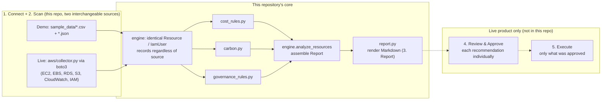

# Architecture

The live product describes its process in two places: a five-stage overview (Connect, Scan, Report, Review & Approve, Execute) and a four-step detail section (Connect AWS Securely, Define Your Goals, Review Recommendations, Approve and Monitor). This repository implements Connect, Scan, and Report end to end, against either a real AWS account or committed sample data. Define Your Goals (a preferences UI) and Review & Approve / Execute (an action-execution workflow) are not implemented; they're the live product's dashboard and paid-phase concerns, not something a CLI tool should do unattended.



## Why two sources feed one pipeline

`engine.analyze(data_dir)` (demo mode) and `aws/collector.py`'s `collect_all(regions)` (live mode) both terminate in the same `list[Resource]` / `list[IamUser]`, then both call the same `engine.analyze_resources(...)`. Every rule, the carbon formula, and the report renderer are written once and run identically against either source. That's not just less code to maintain: it means the sample data is provably not a special case, the exact same logic that reads a real AWS account also reads `sample_data/`.

## Why the input data is split in two (and, live, in five)

`cost_and_usage.csv` (billing) and `resource_inventory.json` (configuration and utilization) are joined on `resource_id` in demo mode. Live mode is more granular still: EC2/EBS/RDS come from `describe_*` calls plus CloudWatch metrics, S3 from `list_buckets` plus five separate per-bucket API calls (location, lifecycle, public-access block, encryption, versioning), and IAM from a `GetCredentialReport` CSV. That mirrors how a real read-only collector actually has to work: cost and configuration genuinely come from different AWS APIs, and `aws/collector.py` degrades gracefully (a warning, not a crash) if any single one of them is unavailable or unauthorized.

## Why rules are plain functions

Every rule in `cost_rules.py`, `carbon.py`, and `governance_rules.py` has the signature `list[Resource] -> list[Finding]` (or `list[IamUser] -> list[Finding]` for credential hygiene). That makes each one independently testable (see `tests/`) and easy to compose: adding a new waste pattern is one new function plus one line in `ALL_COST_RULES`.

## Why the AWS collector takes clients, not a Session

`collect_ec2(ec2_client, cloudwatch_client, region)` and friends accept already-constructed boto3 clients rather than building their own from a `Session` internally. That's what makes `tests/test_aws_collector.py` possible without any real AWS account: each test wraps a plain `boto3.client(...)` in a `botocore.stub.Stubber`, which intercepts the call before it would ever be signed or sent over the network, and validates the canned response against AWS's own service model. `collect_all()` is the only place that builds real clients from a real `boto3.Session`.

## Rule-based today

The live product's roadmap lists ML-based optimization scoring as a later phase. This repo doesn't pretend otherwise: the engine here is the same rule-based approach the live pilot runs today, not a stand-in for the roadmap item.

## Read-only by construction

Every boto3 call in `aws/collector.py` is a `describe_*`, `get_*`, `list_*`, or `generate_credential_report` action, matching exactly the actions allowed in [`iam/read-only-collector-policy.json`](../iam/read-only-collector-policy.json). There is no code path here, live or demo, that could change infrastructure even by accident.

## Package layout

```
src/greenpilot/
├── models.py                 # Resource, IamUser, Finding, CarbonEstimate, Report
├── credential_report.py      # parses an AWS IAM credential report (live or sample)
├── rules/
│   ├── cost_rules.py         # idle/underutilized EC2, unattached EBS, redundant RDS, misclassified S3, schedulable EC2
│   ├── carbon.py              # CO2e formula (see carbon-methodology.md)
│   └── governance_rules.py   # GDPR data residency, NIS2 posture + credential hygiene, CSRD relevance
├── engine.py                  # load_resources/load_iam_users (demo) + analyze_resources (shared core)
├── aws/collector.py           # boto3 collectors, mapped onto the same records (live)
├── report.py                   # Report -> Markdown
└── cli.py                      # `greenpilot analyze --source sample|live`
```
