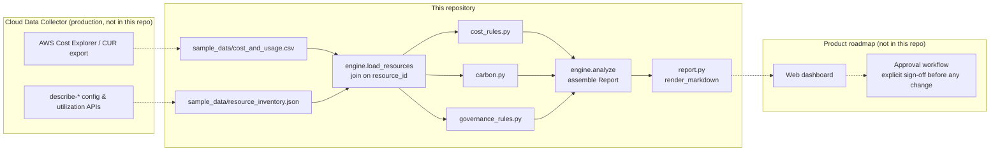

# Architecture

GreenPilot AI's intended production architecture (as described on [greenpilotai.com/platform.html](https://greenpilotai.com/platform.html)) has four parts: a read-only cloud data collector, a rule-based optimization engine, a web dashboard, and an approval-based action workflow. This repository implements the first two end-to-end and stubs the report as the stand-in for the dashboard — the pieces that actually demonstrate the product's logic.



## Why it's split this way

- **Two input files, joined on `resource_id`** (`cost_and_usage.csv` + `resource_inventory.json`) mirrors how a real read-only collector would actually work: billing data comes from Cost Explorer/CUR, configuration and utilization come from separate `describe-*` calls. Modeling that join — rather than one flat file — keeps the sample data honest about where each number would really come from.
- **Rules are pure functions** (`list[Resource] -> list[Finding]`). Every rule in `cost_rules.py`, `carbon.py`, and `governance_rules.py` can be tested in isolation (see `tests/`) and composed freely — adding a new waste pattern is one new function plus one line in `ALL_COST_RULES`.
- **Rule-based today, ML-based later** — the live product's own roadmap lists "ML-based optimization" as a Phase 2 item. This repo doesn't pretend otherwise: v1 here is explicitly the same rule-based engine the live pilot runs today.
- **Read-only by construction** — nothing in this package calls AWS or mutates anything. It only ever reads local files and writes a report. That mirrors the live product's "read-only by default, approval-based automation" trust model — there's no code path here that *could* change infrastructure even if you wanted it to.

## Package layout

```
src/greenpilot/
├── models.py     # Resource, Finding, CarbonEstimate, Report — the shared vocabulary
├── rules/
│   ├── cost_rules.py        # idle/underutilized EC2, unattached EBS, redundant RDS, misclassified S3, schedulable EC2
│   ├── carbon.py            # CO2e formula (see carbon-methodology.md)
│   └── governance_rules.py  # GDPR data-residency, NIS2 posture, CSRD relevance
├── engine.py     # load_resources + orchestration -> Report
├── report.py     # Report -> Markdown
└── cli.py        # `greenpilot analyze <data_dir>`
```
