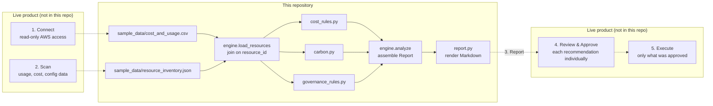

# Architecture

The live product describes its process in two places: a five-stage overview (Connect, Scan, Report, Review & Approve, Execute) and a four-step detail section (Connect AWS Securely, Define Your Goals, Review Recommendations, Approve and Monitor). This repository implements the middle of that pipeline: the part that turns raw AWS data into a ranked report. It does not implement Connect (a live AWS integration), Define Your Goals (a preferences UI), or Execute (an action-execution workflow).



## Why the input data is split in two

`cost_and_usage.csv` (billing) and `resource_inventory.json` (configuration and utilization) are joined on `resource_id` rather than shipped as one flat file. That mirrors how a real read-only collector would actually populate them: billing figures come from Cost Explorer or a CUR export, configuration and utilization come from separate `describe-*` calls. Keeping the sample data in that shape keeps it honest about where each number would come from in production.

## Why rules are plain functions

Every rule in `cost_rules.py`, `carbon.py`, and `governance_rules.py` has the signature `list[Resource] -> list[Finding]`. That makes each one independently testable (see `tests/`) and easy to compose: adding a new waste pattern is one new function plus one line in `ALL_COST_RULES`.

## Rule-based today

The live product's roadmap lists ML-based optimization scoring as a later phase. This repo doesn't pretend otherwise: the engine here is the same rule-based approach the live pilot runs today, not a stand-in for the roadmap item.

## Read-only by construction

Nothing in `src/greenpilot/` calls AWS or writes to anything outside the local filesystem. It reads two input files and produces a report. That mirrors the live product's read-only, approval-based model: there is no code path here that could change infrastructure even if it tried.

## Package layout

```
src/greenpilot/
├── models.py     # Resource, Finding, CarbonEstimate, Report: the shared vocabulary
├── rules/
│   ├── cost_rules.py        # idle/underutilized EC2, unattached EBS, redundant RDS, misclassified S3, schedulable EC2
│   ├── carbon.py             # CO2e formula (see carbon-methodology.md)
│   └── governance_rules.py   # GDPR data residency, NIS2 posture, CSRD relevance
├── engine.py     # load_resources + orchestration -> Report
├── report.py     # Report -> Markdown
└── cli.py        # `greenpilot analyze <data_dir>`
```
